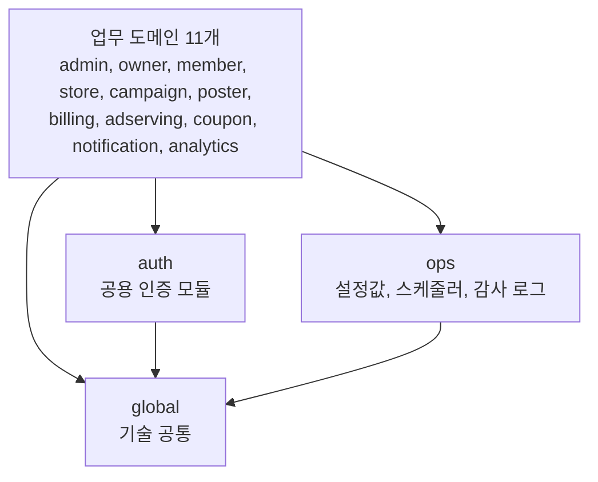
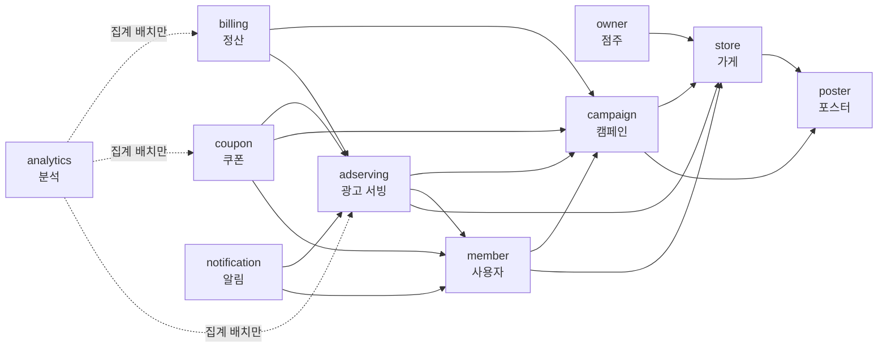

# 런치캐치 도메인 구조와 의존성 설계

| 항목 | 내용 |
|---|---|
| 목적 | 팀원이 이 문서 하나로 구조와 규칙을 이해하고 코드를 쓸 수 있게 한다 |
| 그래프 | 도메인 간 의존 노드 14 / import 간선 61 / 순환 0 |
| 참고 | 우아한 객체지향 |

문서는 두 장이다. **1장은 코드를 어디에 두는가**(계층, 도메인, 패키지), **2장은 도메인끼리 어떻게 연결되는가**(의존 규칙, 방향, 상태 변경)를 다룬다.

---

## 1. 계층 구조

### 1.1 3개의 계층



| 계층 | 무엇 | 규칙 |
|---|---|---|
| 업무 도메인 | 기능과 데이터를 소유하는 11개 | 2장의 의존 규칙을 따른다 |
| `auth`, `ops` | 모든 도메인이 쓰는 하위 모듈 | 어떤 업무 도메인도 의존하지 않는다(규칙 3, 5) |
| `global` | 예외, 응답 포맷, 거리 계산처럼 도메인 지식이 없는 코드 | 아무것도 의존하지 않는다 |

아래 계층은 위 계층을 의존하지 않는다. 스케줄러도 `ops`에 있지만 작업 내용은 각 도메인이 `ops.scheduler.DailyJob`을 구현해 등록하므로, 의존은 도메인 -> `ops` 한 방향이다.

### 1.2 도메인

기능은 **데이터를 소유한 도메인**에 둔다. 관리자가 쓰는 화면이라도 점주 데이터면 점주 도메인에 있고, 관리자만 부를 수 있다는 제약은 `auth`의 역할 검사가 맡는다.

| 패키지 | 도메인 | 소유하는 데이터 |
|---|---|---|
| `admin` | 관리자 | 관리자 계정 |
| `owner` | 점주 | 점주 계정과 상태 |
| `member` | 사용자 | 사용자 계정, 프로필, 저장 위치, 관심 가게, 동의 설정 |
| `store` | 가게 | 가게, 입점 신청, 사업자 검증, 이미지와 메뉴, 그날의 캠페인 요약 |
| `campaign` | 캠페인 | 캠페인(쿠폰 조건, 노출 대상, 하루 예산, 기간, 상태), 그날 예약액, 당일 소진 카운터, 그날 단가 스냅샷 |
| `poster` | 포스터 | 템플릿, 포스터, 자동 검수 결과 |
| `billing` | 정산 | 포인트 원장, 점주 잔액, 결제와 환불 |
| `adserving` | 광고 서빙 | 일일 피드 후보 스냅샷, serve 기록, 노출 로그, 사용자 당일 이력, 찜/패스 이력(30일), 찜 목록 |
| `coupon` | 쿠폰 | 발급된 쿠폰(순번, QR, 사용 이력) |
| `notification` | 알림 | 알림 발송 이력, 푸시 등록 정보 |
| `analytics` | 분석 | 전환 퍼널 이벤트 로그, 일별 집계, 리포트 |
| `ops` | 운영 | 플랫폼 설정값, 스케줄러와 실행 이력, 감사 로그 |
| `auth` | 공용 인증 | 토큰, 역할 |

### 1.3 패키지

```
com.launchcatch
├── global/  auth/  ops/
├── admin/  owner/  member/  store/  campaign/  poster/
└── billing/  adserving/  coupon/  notification/  analytics/
```

**1차**는 도메인으로 나누고, 그 안을 계층으로 나눈다. **2차**는 도메인이 커지면 애그리거트(트랜잭션에서 일관성을 보장하는 단위) 단위로 하위 패키지를 나눈다. 작은 도메인은 나누지 않고 계층 폴더만 둔다. 또한 읽기만 하는 조회와 진단은 읽기 전용 패키지로 뗄 수 있다. 하위 패키지 안도 계층으로 나눈다. 광고 서빙이 그 예다.

```
adserving/
├── contract/
│   ├── WishlistQueryService.java      공개 (contract)
│   └── CandidateStateUpdater.java     공개 (contract)
├── engine/                            후보 스냅샷(AdCandidate)과 배정 계산
│   ├── FeedAssembler.java
│   ├── SlotAllocator.java
│   ├── entity/AdCandidate.java
│   └── job/LoadDailyCandidateJob.java
├── impression/                        노출 로그(ImpressionLog)
│   ├── controller/ImpressionController.java
│   ├── service/ImpressionValidator.java
│   ├── repository/ImpressionLogRepository.java
│   └── entity/ImpressionLog.java
├── feed/                              서빙 기록(ServeLog)과 찜, 패스
│   ├── controller/FeedController.java
│   ├── service/ServeRecordService.java
│   └── entity/ServeLog.java
├── wishlist/                          찜 목록(Wishlist)
│   ├── controller/WishlistController.java
│   └── service/WishlistService.java
└── diagnosis/                         배정 진단. 서빙 기록을 읽기만 한다(읽기 전용)
    ├── controller/FeedDiagnosisController.java
    └── service/FeedDiagnosisService.java
```

작은 도메인은 하위 패키지 없이 계층 폴더만 둔다. 캠페인과 정산이 그렇다.

```
campaign/
├── contract/
│   └── CampaignQueryService.java      공개 (contract)
├── controller/
├── service/
├── repository/
├── entity/
└── job/
```

**다른 도메인에 공개하는 것은 모두 그 도메인의 `contract` 패키지에 둔다. 나머지 폴더는 내부다.**

```
campaign/
├── contract/
│   ├── CampaignQueryService.java      공개. 조회 인터페이스
│   ├── PointDeductionService.java     공개. 과금 판정과 차감
│   ├── DailyReservationUpdater.java   공개. 명령 인터페이스
│   ├── CampaignEndedEvent.java        공개. 발행 이벤트
│   └── BillingStatus.java             공개. 주고받는 타입
├── controller/                        내부. HTTP 진입점
├── service/                           내부. 업무 로직, 인터페이스 구현
├── repository/                        내부. MySQL, Valkey 접근
├── entity/                            내부
├── listener/                          내부. 다른 도메인 이벤트 수신
└── job/                               내부. 스케줄러 작업
```

| 공개 (`contract` 패키지) | 예 |
|---|---|
| 조회 인터페이스 (구현은 내부 `service`) | `campaign.contract.CampaignQueryService` |
| 명령 인터페이스 (구현은 내부 `service`) | `campaign.contract.DailyReservationUpdater` |
| 발행 이벤트 | `campaign.contract.CampaignEndedEvent` |
| 위 셋이 주고받는 record, enum | `campaign.contract.BillingStatus` |

도메인 간에 보이는 것은 조회 인터페이스 8개, 명령 인터페이스 5개, 이벤트 10개, 모두 23개다. 주고받는 타입은 record로 만들고 엔티티를 내보내지 않는다. 이 record는 도메인 간 DTO다. 클라이언트용 컨트롤러 DTO와는 바뀌는 이유가 달라 섞어 쓰지 않는다. 조회와 명령을 모두 인터페이스로 두고 구현은 내부 `service`에 둔다. contract에 로직이 들어갈 자리를 없애고, "contract에는 인터페이스, record, enum만 둔다"를 테스트로 막기 위해서다.

### 1.4 계층 규칙

| 계층 | 어디 | 부를 수 있는 것 |
|---|---|---|
| Controller | `controller/` | Service |
| Entry | `listener/`, `job/` | Service |
| Service | `service/` (contract 인터페이스의 구현 포함) | Repository, 다른 도메인의 contract 인터페이스 |
| Repository | `repository/` | 없음(저장소만) |

**도메인 contract는 계층이 아니라 계약이다.** 인터페이스와 그것이 주고받는 record, enum만 두므로 부를 코드가 없다. 다른 도메인은 contract 인터페이스를 부르고, 그 구현은 받는 도메인의 `service` 계층에 있다. 진입점은 바깥 HTTP로 들어오는 Controller와 이벤트, 스케줄로 들어오는 Entry 둘이다.

### 1.5 계층을 지키는 테스트

| 테스트 | 지키는 것 |
|---|---|
| `계층_의존_규칙` | 1.4의 표 |
| `운영은_어떤_도메인도_의존하지_않는다` | 규칙 3 |
| `인증_모듈은_어떤_도메인도_의존하지_않는다` | 규칙 5 |
| `기술_공통은_아무것도_의존하지_않는다` | global은 가장 아래 모듈 |
| `관리자는_다른_업무_도메인을_의존하지_않는다` | 기능을 데이터 소유 도메인에 둔다는 결정 |
| `contract에는_인터페이스_record_enum만_둔다` | contract에 로직을 두지 않는다. 구현은 내부 패키지에 |
| `contract는_entity와_repository를_참조하지_않는다` | contract 인터페이스와 record가 엔티티를 드러내지 않는다 |

---

## 2. 도메인 의존 그래프

### 2.1 의존 규칙

명세서 도메인 정의 시트 18~23행이 원본이다.

| 번호 | 규칙 | 한 줄 해설 |
|---|---|---|
| 1 | 각 도메인은 자기 애그리거트만 직접 읽고 쓴다. 다른 도메인의 데이터는 그 도메인이 공개한 기능으로만 다룬다 | 남의 엔티티와 저장소를 직접 쓰지 않는다. 연관은 ID로만 갖는다 |
| 2 | 분석은 전환 퍼널 이벤트 로그와 자기 집계 테이블만 읽는다. 일별 집계 배치는 예외로 다른 도메인 데이터를 읽을 수 있으며, 조회 기능은 집계 결과만 읽는다 | 유일한 예외는 집계 배치 |
| 3 | 운영은 다른 도메인과 같은 층이 아니라 아래에서 떠받치는 설정 제공 모듈이다. 운영은 어떤 도메인도 의존하지 않고, 모든 도메인이 운영의 설정값을 읽는다 | 1.1 |
| 4 | 스케줄러는 실행 순서와 멱등만 책임진다. 각 작업의 내용은 해당 도메인이 구현해 등록하며, 앞 작업이 실패하면 뒤 작업을 실행하지 않는다 | 1.1 |
| 5 | 인증과 인가는 모든 도메인이 직접 가져다 쓰는 공용 인증 모듈이다 | 도메인마다 권한 체크를 따로 만들지 않는다 |
| 6 | 도메인 간 의존은 순환 없이 한 방향으로 둔다. 의존하는 도메인은 상대가 공개한 기능을 직접 호출해 읽거나 쓰고, 의존받는 도메인은 자기 이벤트를 발행해 알린다. 새 의존은 순환이 생기지 않는 방향으로 정한다 | 2.2 ~ 2.4 |

### 2.2 그래프

import가 있으면 의존하는 것이다. 그리고 모든 도메인 간 간선은 **조회에서 생긴다.** 데이터가 필요한 쪽이 소유한 쪽을 조회하고, 그 방향이 의존 방향이 된다. 쓰기 호출과 이벤트는 조회로 이미 생긴 간선을 그대로 쓰므로 간선을 추가하지 않는다. 서로를 조회하는 두 도메인은 없다.



화살표는 "의존한다(조회한다)"는 뜻이다. 분석은 집계 배치로 모든 업무 도메인을 읽는다(그림에는 일부만).

| 간선 | 무엇을 읽나 |
|---|---|
| adserving -> campaign | 00:00 후보 스냅샷, 예산 소진 진행률, 과금 판정 |
| adserving -> store, member | 후보 스냅샷의 가게 정보, 노출 대상 필터와 저장 위치 |
| billing -> campaign | 환불 조건(활성 캠페인), 대조 배치의 당일 소진, 예약 대상 |
| billing -> adserving | 대조 배치가 원인을 가리려고 읽는 노출 로그 |
| coupon -> adserving, campaign, member | 찜 여부(발급 자격), 선착순 수량과 사용 시간, 사용자 정지 여부 |
| notification -> adserving, member | 찜 보유 사용자, 관심 가게와 수신 동의 |
| member -> store, campaign | 관심 가게 목록의 운영 상태와 활성 캠페인 |
| owner -> store | 점주 목록의 상호와 등록 여부 |
| campaign -> store, poster | 가게 확인, 포스터 검수 결과 |
| store -> poster | 가게 상세에 넣을 포스터 |

그래프에서 화살표는 모두 왼쪽에서 오른쪽으로 간다. 왼쪽은 여러 도메인의 데이터를 모아 쓰는 도메인이고, 오른쪽은 여러 도메인이 기준으로 읽는 데이터다. **추가하는 간선이 오른쪽에서 왼쪽으로 가면 순환 후보다.** 예를 들어 `campaign -> billing`이나 `store -> campaign`은 순환이 생긴다.

### 2.3 방향을 정한 기준

1. 데이터가 필요한 쪽이 소유한 쪽을 조회한다. 즉, 다른 도메인의 데이터를 조회하는 쪽이 의존한다. 읽는 쪽에서 소유한 쪽으로 간선이 연결된다.
2. 도메인간에 서로 읽으려 하면 한 방향만 남긴다. 서로 읽으면 순환이 생기기 때문이다. 남기는 방향은 그 데이터를 못 읽으면 기능이 아예 돌지 않는 쪽이다. 만일, 반대쪽에서 꼭 필요하다면 아래 3개중 하나로 해결한다.
   * 의존하는 쪽이 값을 넘기거나, 의존받는 쪽이 이벤트로 알린다. 예시) 캠페인이 상태가 바뀌면 이벤트를 발행하고 광고 서빙이 받는다
   * 읽을 필요 자체를 없앤다. 예시) 포스터는 쿠폰 조건을 캠페인에서 읽지 않고 클라이언트가 함께 보낸다.
   * 클라이언트가 화면에서 합친다. 예시) 찜 목록 화면은 클라이언트가 광고 서빙(찜 목록)과 쿠폰(잔여 수량)을 각각 불러 합친다
3. 여러 도메인이 함께 읽는 것은 하위 모듈로 내린다. 인증은 `auth`, 노출 단가와 하루 예산 하한 같은 정책값은 `ops`. 반대로 모든 도메인을 읽는 분석은 최상위 모듈에 두고 누구도 분석을 호출하지 않는다.

### 2.4 도메인 간 상태 변경과 이벤트

**이벤트는 직접 호출하면 순환이 생기는 자리에서만 쓴다.** 그 외에는 상대 도메인이 공개한 기능을 직접 호출한다.

| 상대와의 관계 | 쓰는 것 |
|---|---|
| 내가 상대를 의존한다 | 상대 `contract`의 인터페이스를 호출한다. 읽기는 조회 인터페이스, 바꾸기와 알리기는 명령 인터페이스를 쓴다 |
| 상대가 나를 의존한다 | 내 이벤트를 발행한다. 상대 데이터는 읽지 않고, 필요하면 상대가 호출로 넘겨준다 |

직접 호출과 이벤트 중 무엇을 쓸지를 먼저 정하고, 이벤트로 정해졌다면 같은 트랜잭션, 비동기 중에 처리 방식을 고른다.  이 기준으로 정한 결과가 이벤트 10종과 직접 호출 5건이다.

이벤트 10종이며, 의존받는 쪽이 발행한다.

* 이벤트 타입은 발행 도메인의 `contract` 패키지에 둔다.
* 분석으로 가는 전환 퍼널 7종 이벤트는 간선을 추가하지 않는다. 분석이 집계 배치로 발행 도메인을 이미 읽고 있기 때문이다.

| 이벤트 | 발행 -> 수신 | 받는 쪽이 하는 일 | 처리 |
|---|---|---|---|
| `PointDeductedEvent` | campaign -> billing | 원장 DEDUCT 기록 | 같은 트랜잭션 |
| `CampaignEndedEvent` | campaign -> adserving | 찜 목록에서 자동 제거 | 발행자 트랜잭션 |
| `CampaignStatusChangedEvent` | campaign -> adserving | 그날 후보의 서빙 상태 변경 | 같은 트랜잭션 |
| 전환 퍼널 7종 (`ImpressionServedEvent`, `SwipedEvent`, `CouponIssuedEvent`, `CouponIssueOpenedEvent`, `CouponRedeemedEvent`, `CouponExpiredEvent`, `NotificationSentEvent`) | adserving, coupon, notification -> analytics | 전환 퍼널 기록 | 비동기, 유실 허용 |

**직접 호출 5건 (의존하는 쪽이 호출)**

| 호출 | 공개 인터페이스 | 받는 쪽이 하는 일 |
|---|---|---|
| campaign -> store | `store.contract.StoreCampaignSummaryUpdater` | 가게 화면용 그날의 캠페인 요약 갱신 |
| billing -> campaign | `campaign.contract.DailySpentRecoveryService` | 원장 기준으로 당일 소진 카운터 재구성 |
| billing -> campaign | `campaign.contract.DailyReservationUpdater` | 그날 예약액 반영, 충전 재예약이면 재개 판정 |
| coupon -> adserving | `adserving.contract.CandidateStateUpdater` | 선착순 소진 시 그날 후보에 소진 표시 |
| adserving -> campaign | `campaign.contract.StoreAudienceUpdater` | 가게별 대상 인원 덮어쓰기(예산 추천 입력) |

**퍼널 이벤트 11종의 기록 경로.** 서버에서 일어나는 8종은 위 이벤트로 분석에 간다. 화면 조회 3종(wishlist_view, map_view, poster_open)은 클라이언트가 분석의 수집 API로 직접 보낸다. 클라이언트와 분석 사이의 호출이라 도메인 간 간선이 아니다.

노출 차감(`campaign.contract.PointDeductionService.deduct`)도 광고 서빙이 캠페인을 의존하는 쪽이라 직접 호출이다. 과금 결과를 바로 돌려받아야 해서 이벤트로는 할 수 없다.

```java
// 받는 도메인(store)이 자기 contract 에 공개한 명령 인터페이스
package com.launchcatch.store.contract;

public interface StoreCampaignSummaryUpdater {
    void update(long storeId, long campaignId, CampaignSummaryCommand command);
}

// 의존하는 도메인(campaign)이 부른다. store 의 내부는 보지 않는다
package com.launchcatch.campaign.service;

import com.launchcatch.store.contract.StoreCampaignSummaryUpdater;   // campaign -> store, 이미 있는 간선

@Service
@RequiredArgsConstructor
public class CampaignStatusService {

    private final CampaignRepository campaignRepository;
    private final StoreCampaignSummaryUpdater summaryUpdater;
    private final ApplicationEventPublisher events;

    @Transactional
    public void pause(long campaignId, PauseReason reason, LocalDate businessDate) {
        Campaign campaign = campaignRepository.findById(campaignId).orElseThrow();
        campaign.pause(reason);
        summaryUpdater.update(campaign.getStoreId(), campaign.getId(), toSummary(campaign)); // 호출
        events.publishEvent(new CampaignStatusChangedEvent(campaign.getId(), businessDate, false)); // 이벤트
    }
}
```

**이벤트 처리 기준**
- 기본은 **같은 트랜잭션**이다. 리스너에 `@EventListener`만 붙이면 발행자와 같은 스레드, 같은 트랜잭션에서 돌아 유실이 없다.
- **비동기는 분석으로 가는 퍼널 기록뿐**이다(`@Async` + `@TransactionalEventListener(AFTER_COMMIT)`). 노출과 발급처럼 성능 목표가 걸린 경로에서 분석 DB 쓰기를 빼고, 일별 수치는 집계 배치가 원본에서 복구하므로 유실을 허용한다.
- 페이로드는 **식별자와 값만** 싣는다. 엔티티를 실으면 받는 쪽이 남의 `entity` 패키지를 import하게 된다.

### 2.5 그래프를 지키는 테스트

| 테스트 | 지키는 것 |
|---|---|
| `도메인_내부는_같은_도메인에서만_쓴다` | 규칙 1. 다른 도메인의 entity와 repository를 참조하지 않는다 |
| `엔티티는_다른_도메인_엔티티를_참조하지_않는다` | 규칙 1. 연관은 ID로만 |
| `분석_조회는_집계만_읽는다` | 규칙 2 |
| `순환_의존이_없다` | 규칙 6 |
| `이벤트_타입은_정해진_도메인_contract에_둔다` | 이벤트 10종이 2.4 표의 발행 도메인 contract에 있다. 새 이벤트를 만들면 목록도 함께 고친다 |

```java
@ArchTest
static final ArchRule 순환_의존이_없다 =
        slices().matching("com.launchcatch.(*)..").should().beFreeOfCycles();

// 이벤트 타입마다 둘 도메인을 고정한다. 다른 곳에 두면 그 타입 하나를 가리켜 실패한다
private static final Map<String, String> EVENT_HOME = Map.ofEntries(
        Map.entry("PointDeductedEvent", "campaign"),
        Map.entry("CampaignEndedEvent", "campaign"),
        Map.entry("CampaignStatusChangedEvent", "campaign"),
        Map.entry("ImpressionServedEvent", "adserving"),
        Map.entry("SwipedEvent", "adserving"),
        Map.entry("CouponIssuedEvent", "coupon"),
        Map.entry("CouponIssueOpenedEvent", "coupon"),
        Map.entry("CouponRedeemedEvent", "coupon"),
        Map.entry("CouponExpiredEvent", "coupon"),
        Map.entry("NotificationSentEvent", "notification"));

@ArchTest
static final ArchRule 이벤트_타입은_정해진_도메인_contract에_둔다 = classes()
        .that().haveSimpleNameEndingWith("Event")
        .and().resideOutsideOfPackage("..analytics..")
        .should(new ArchCondition<JavaClass>("목록에 적힌 도메인의 contract 에 있다") {
            @Override
            public void check(JavaClass c, ConditionEvents events) {
                String home = EVENT_HOME.get(c.getSimpleName());
                if (home == null) {
                    events.add(SimpleConditionEvent.violated(c, c.getName() + " 가 목록에 없다"));
                } else if (!c.getPackageName().equals("com.launchcatch." + home + ".contract")) {
                    events.add(SimpleConditionEvent.violated(c, c.getName() + " 는 " + home + ".contract 에 있어야 한다"));
                }
            }
        });
```

**테스트가 잡지 못하는 것.** 네이티브 쿼리 문자열 안의 남의 테이블 이름. 코드 리뷰에서 본다.

### 2.6 새 기능을 넣을 때

1. 그 기능이 쓰는 데이터는 **누가 소유하나**. 소유 도메인에 기능을 둔다(1.2).
2. 다른 도메인 데이터가 필요하면 그 도메인 **contract의 공개 기능**으로만 읽는다(1.3). 없으면 contract에 조회 메서드를 새로 만든다. 범용 `findById`를 열지 않는다.
3. 도메인 간 간선을 추가하면 **2.2 그래프에서 오른쪽에서 왼쪽으로 가는 간선인지** 본다. 거스르면 2.3의 세 방법으로 푼다.
4. 다른 도메인의 상태를 바꾸거나 알려야 하면 2.4 표대로 정한다.
5. `순환_의존이_없다`가 통과하는지 확인한다.

