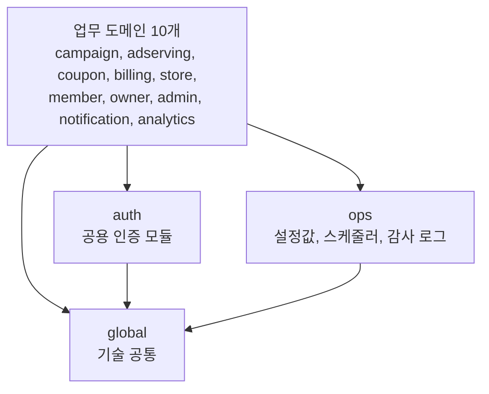
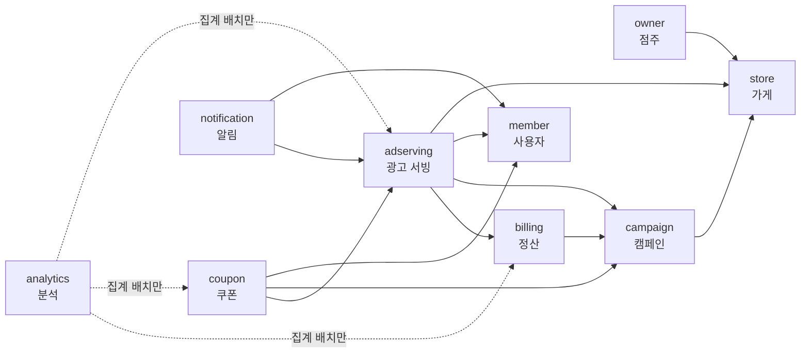

# 런치캐치 도메인 구조와 의존성 설계

| 항목 | 내용 |
|---|---|
| 목적 | 팀원이 이 문서 하나로 구조와 규칙을 이해하고 코드를 쓸 수 있게 한다 |
| 그래프 | 도메인 간 의존 노드 13 / import 간선 53 / 순환 0 |
| 참고 | 우아한 객체지향 |

문서는 두 장이다. **1장은 코드를 어디에 두는가**(계층, 도메인, 패키지), **2장은 도메인끼리 어떻게 연결되는가**(의존 규칙, 방향, 상태 변경)를 다룬다.

---

## 1. 계층 구조

### 1.1 3개의 계층



| 계층 | 역할 | 규칙 |
|---|---|---|
| 업무 도메인 | 기능과 데이터를 소유하는 10개 | 2장의 의존 규칙을 따른다 |
| `auth`, `ops` | 모든 도메인이 쓰는 하위 모듈 | 어떤 업무 도메인도 의존하지 않는다(규칙 3, 5) |
| `global` | 예외, 응답 포맷, 거리 계산처럼 도메인 지식이 없는 코드 | 아무것도 의존하지 않는다 |

아래 계층은 위 계층을 의존하지 않는다. 스케줄러도 `ops`에 있지만 작업 내용은 각 도메인이 `ops.scheduler.DailyJob`을 구현해 등록하므로, 의존은 도메인 -> `ops` 한 방향이다.

### 1.2 도메인

도메인 정의 기준은 아래를 따른다.

* **요구사항 변경으로 함께 바뀌는 것끼리 도메인으로 묶고, 따로 바뀌는 것은 분리한다.** 같이 변경되는 코드는 묶고 같이 변경되지 않는 코드는 분리해야 응집도는 높고 결합도는 낮다.
* **한 트랜잭션으로 묶어야 하는 것은 같은 도메인으로 두는 최소 조건이다.** 이 조건이 성립하면 반드시 묶고, 성립하지 않는다고 나누지는 않는다. 두 데이터에 걸친 규칙은 한 도메인이 지켜야 한다. 두 데이터를 다른 도메인에 두면 각자 따로 바꾸는 경로가 생겨 규칙이 깨질 수 있다.
* **같은 도메인이라도 변경 주기가 다른 것은 한 트랜잭션으로 묶지 않는다.** 이런 데이터는 도메인 안에서 하나의 트랜잭션에서 일관성을 함께 보장해야 하는 묶음(애그리거트)으로 나눈다. 변경 주기가 다른 데이터를 한 트랜잭션으로 묶으면, 한쪽의 긴 작업이 다른 쪽 요청까지 락으로 막아 장애가 번진다.
* **도메인 간 순환은 잘못 나눴다는 신호다.** 3개의 도메인이 순환하면 원래 하나여야 할 것을 셋으로 나눈 것이다. 그래서 도메인을 분리할 때는 다른 도메인과 구별되는 명확한 개념이 있어야 한다.

| 도메인 | 요구사항 변경으로 함께 바뀌는 것 | 소유 데이터 | 경계를 정한 근거 |
|---|---|---|---|
| `campaign` 캠페인 | 점주가 광고를 구성하는 규칙(쿠폰 조건, 대상, 기간) | 캠페인, 상태 이력, 가게별 대상 인원, 포스터와 검수 결과, 템플릿과 버전 | 쿠폰 조건이 바뀌면 포스터와 템플릿 검수도 바뀌어 셋을 함께 묶는다. 변경 주기가 달라 애그리거트는 셋으로 나눈다 |
| `adserving` 광고 서빙 | 배정 알고리즘과 공정성 | 일일 광고 피드 후보 스냅샷, serve 기록, 노출 로그, 사용자 당일 이력, 스와이프 이력, 찜 목록, 광고 피드 필터, 일별 접속 위치 | 배정에 영향을 주는 사용자 설정(필터)도 배정과 함께 바뀌어 여기에 둔다 |
| `coupon` 쿠폰 | 선착순, QR, 사용 처리 규칙 | 발급 회차, 사용자 하루 발급 한도, 발급된 쿠폰(순번, QR, 사용 이력) | 쿠폰 조건은 캠페인 설정과 함께 바뀌어 캠페인에, 발급과 사용은 따로 바뀌어 쿠폰에 둔다 |
| `billing` 정산 | 결제, 단가, 노출 차감, 환불 규정 | 포인트 원장, 점주 잔액, 결제와 환불, 그날 예약액, 단가 스냅샷, 시간대별 목표, 당일 소진 카운터, 노출 차감 판정 기록 | 당일 소진 카운터와 원장 DEDUCT는 한 트랜잭션으로 묶어야 해서 같은 도메인에 둔다(최소 조건) |
| `store` 가게 | 입점 절차와 가게 정보 | 가게, 입점 신청, 점주 약관 동의, 사업자 검증, 이미지와 메뉴, 그날의 캠페인 요약 | 약관 동의는 입점 절차와 함께 바뀌어 점주가 아니라 가게에 둔다 |
| `member` 회원 | 온보딩, 위치, 동의 정책 | 회원 계정, 프로필, 저장 위치, 동의 설정 | 사용자 정보는 광고 피드 배정과 따로 바뀐다 |
| `owner` 점주 | 점주 계정 정책(가입, 로그인, 정지, 탈퇴) | 점주 계정과 상태 | 점주 계정은 입점 절차와 따로 바뀌어 가게와 나눈다. 점주 상태 전환은 가게 최종 등록과 선후 관계뿐이라 이벤트로 잇는다 |
| `admin` 관리자 | 관리자 계정 정책(발급, 권한) | 관리자 계정 | 관리자가 쓰는 화면이라도 점주, 사용자 데이터를 다루는 기능은 그 데이터의 도메인에 둔다. 그래서 계정만 남는다 |
| `notification` 알림 | 발송 채널과 규칙 | 알림 발송 이력, 푸시 등록 정보 | 수신 동의는 사용자 정책과 함께 바뀌어 사용자에 두고, 알림이 발송할 때 조회한다 |
| `analytics` 분석 | 리포트와 집계 요구 | 전환 퍼널 이벤트 로그, 일별 집계, 캠페인 리포트 | 캠페인 리포트는 노출, 찜, 발급을 모은 집계라 캠페인에 두면 순환이 생긴다 |
| `auth` 공용 인증 | 인증 정책(94행) | 토큰 발급, 검증, 회전 정책과 역할 | 인증은 도메인이 아니다. Refresh Token 해시는 계정과 함께 각 계정 도메인의 테이블에 두고, 인증 모듈이 정의한 저장 인터페이스를 각 도메인이 구현한다 |
| `ops` 운영 | 운영 정책 | 플랫폼 설정값, 스케줄러와 실행 이력, 감사 로그 | 모든 도메인이 읽는 값이라 어떤 도메인도 의존하지 않는 하위 계층에 둔다(1.1) |

### 1.3 패키지

```
com.launchcatch
├── global/  auth/  ops/
├── campaign/  adserving/  coupon/  billing/  store/
└── member/  owner/  admin/  notification/  analytics/
```

패키지는 먼저 도메인 단위로 나누고, 도메인이 크면 그 아래를 서브 도메인이나 애그리거트 단위로 한 번 더 나눈다. 서브 도메인 하나에는 애그리거트가 여러 개 들어갈 수 있다. 가장 하위 패키지 안은 계층 구조로 나누고, HTTP, DB, 스케줄에 기대지 않는 순수 계산 로직은 계층 구조에 넣지 않고 그 패키지 바로 아래에 둔다.

```
adserving/
├── contract/
│   ├── WishlistQueryService.java      공개 (contract)
│   └── CandidateStateUpdater.java     공개 (contract)
├── engine/	애그리거트: 후보 스냅샷(AdCandidate)과 배정 계산
│   ├── FeedAssembler.java
│   ├── SlotAllocator.java
│   ├── repository/AdCandidateRepository.java
│   ├── entity/AdCandidate.java
│   └── job/LoadDailyCandidateJob.java
├── impression/	애그리거트: 노출 로그(ImpressionLog)
│   ├── controller/ImpressionController.java
│   ├── service/ImpressionValidator.java
│   ├── repository/ImpressionLogRepository.java
│   └── entity/ImpressionLog.java
├── feed/	서브 도메인: 서빙 기록(ServeLog), 스와이프 이력(SwipeLog), 배정 진단
│   ├── controller/FeedController.java
│   ├── controller/FeedDiagnosisController.java
│   ├── service/ServeRecordService.java
│   ├── service/FeedDiagnosisService.java   배정 진단. 서빙 기록을 읽기만 한다
│   ├── repository/ServeLogRepository.java
│   ├── repository/SwipeLogRepository.java
│   ├── entity/ServeLog.java
│   └── entity/SwipeLog.java
└── wishlist/	애그리거트: 캠페인이 끝날 때까지 유지되는 찜 목록(Wishlist)
    ├── controller/WishlistController.java
    ├── service/WishlistService.java   WishlistQueryService 구현 포함
    ├── repository/WishlistRepository.java
    └── entity/Wishlist.java
```

작은 도메인은 하위 패키지 없이 계층 구조만 둔다. 쿠폰과 알림이 그렇다.

```
coupon/
├── contract/
│   └── CouponIssuedEvent.java         공개 (contract)
├── config/
├── controller/
├── dto/
├── service/
├── repository/
├── entity/
├── job/
├── client/
└── exception/
```

**다른 도메인에 공개하는 것은 모두 그 도메인의 `contract` 패키지에 둔다. 나머지 폴더는 내부다.**

**도메인 이름과 같은 애그리거트는 한 겹을 더 두지 않고 계층 구조를 도메인 바로 아래에 둔다.** `campaign/campaign/service` 처럼 이름이 겹치면 경로가 길어지고 import 에서 어느 쪽이 도메인인지 보이지 않는다. 나머지 애그리거트만 하위 패키지로 나눈다.

```
campaign/
├── contract/
│   ├── CampaignQueryService.java      공개: 조회 인터페이스
│   ├── CampaignFundingUpdater.java    공개: 명령 인터페이스
│   ├── CampaignEndedEvent.java        공개: 발행 이벤트
│   └── CampaignSummary.java           공개: 주고받는 타입
├── config/                            내부: 이 도메인의 @Configuration (보안 체인 등)
├── controller/                        내부: HTTP 진입점
├── dto/                               내부: 요청과 응답 타입
├── service/                           내부: 업무 로직, 인터페이스 구현
├── repository/                        내부: MySQL 접근
├── entity/                            내부
├── listener/                          내부: 다른 도메인 이벤트 수신
├── job/                               내부: 스케줄러 작업
├── exception/                         내부: 오류 코드와 예외
├── poster/                            내부: 포스터와 검수 결과 (애그리거트, 안은 같은 계층 구조)
└── template/                          내부: 템플릿과 버전 (애그리거트, 안은 같은 계층 구조)
```

| 공개 (`contract` 패키지) | 예 |
|---|---|
| 조회 인터페이스 (구현은 내부 `service`) | `campaign.contract.CampaignQueryService` |
| 명령 인터페이스 (구현은 내부 `service`) | `campaign.contract.CampaignFundingUpdater` |
| 발행 이벤트 | `campaign.contract.CampaignEndedEvent` |
| 위 셋이 주고받는 record, enum | `campaign.contract.CampaignSummary` |

도메인 간에 보이는 것은 조회 인터페이스 5개, 명령 인터페이스 5개, 이벤트 10개, 모두 20개다. 조회 인터페이스는 2.2, 명령 인터페이스와 이벤트는 2.4에 있다.

주고받는 타입은 record로 만들고 엔티티를 내보내지 않는다. 이 record는 도메인 간 DTO다. 클라이언트용 컨트롤러 DTO와는 바뀌는 이유가 달라 섞어 쓰지 않는다. 조회와 명령을 구체 클래스가 아니라 인터페이스로 두는 이유는 contract에 로직이 들어갈 자리를 없애고, "contract에는 인터페이스, record, enum만 둔다"를 테스트로 막기 위해서다.

**DB 마이그레이션도 도메인별 폴더로 나눈다.** `src/main/resources/db/migration/{도메인}/V{n}__설명.sql` 에 두고, 버전 n은 도메인마다 1부터 붙인다. 이력 테이블도 도메인마다 `flyway_history_{도메인}` 으로 따로 두어, 다른 도메인과 번호가 겹치거나 적용 순서가 엇갈려도 검증에 걸리지 않는다. 그래서 Spring Boot의 Flyway 자동 설정(`spring.flyway.enabled=false`)은 끄고 도메인마다 Flyway를 따로 실행한다. 한 파일은 자기 도메인 테이블만 만들고 바꾼다. 도메인 사이에 FK가 없어 도메인 간 적용 순서는 맞추지 않는다. 나중에 모듈을 떼면 그 폴더와 이력 테이블만 가져가면 된다.

`global.config.FlywayConfig`와 `DomainFlywayMigrator`가 이것을 한다. 돌려 보고 확인한 함정이 셋이다.

* **`baselineOnMigrate`가 필요하다.** 두 번째 도메인부터는 앞 도메인이 만든 테이블 때문에 스키마가 비어 있지 않다. 그 상태에서 자기 이력 테이블이 없으면 Flyway가 기동을 거부한다
* **`baselineVersion`을 0으로 내려야 한다.** 기본값이 1이라 그냥 켜면 각 도메인의 `V1`이 이미 적용된 것으로 간주되어 건너뛰어진다. 실제로 11개 중 1개만 적용되고 앱은 아무 오류 없이 떴다
* **`ApplicationRunner`로 두면 늦다.** 그것은 컨텍스트가 다 뜬 뒤에 돌아서 Hibernate의 `ddl-auto: validate`보다 뒤다. 빈 DB의 첫 기동이 테이블이 없다는 이유로 깨진다. Spring Boot가 자기 Flyway에 쓰는 것과 같은 후처리기로 엔티티 매니저가 마이그레이션을 기다리게 한다

도메인 목록은 코드에 적지 않고 `db/migration` 아래의 폴더를 훑어 만든다. 적어 두면 새 도메인 폴더를 추가한 사람이 그 목록도 함께 고쳐야 하고, 잊으면 그 도메인의 테이블만 없는 채로 앱이 기동한다.

```java
@Configuration(proxyBeanMethods = false)
public class FlywayConfig {

    static final String MIGRATOR_BEAN = "domainFlywayMigrator";

    @Bean(MIGRATOR_BEAN)
    public DomainFlywayMigrator domainFlywayMigrator(DataSource dataSource) {
        return new DomainFlywayMigrator(dataSource);
    }

    // 엔티티 매니저가 위 빈을 기다리게 한다
    @Configuration(proxyBeanMethods = false)
    static class JpaDependency extends EntityManagerFactoryDependsOnPostProcessor {

        JpaDependency() {
            super(MIGRATOR_BEAN);
        }
    }
}

// DomainFlywayMigrator 는 InitializingBean 이고, 폴더마다 아래를 돌린다
Flyway.configure()
        .dataSource(dataSource)
        .locations("classpath:db/migration/" + domain)
        .table("flyway_history_" + domain)
        .baselineOnMigrate(true)
        .baselineVersion("0")
        .load()
        .migrate();
```

도메인 폴더 밖에 둔 SQL은 어느 이력에도 속하지 않아 영원히 적용되지 않는데 앱은 정상 기동한다. 그래서 기동 때 그 파일을 찾아 막는다.

### 1.4 계층 규칙

| 계층 | 어디 | 부를 수 있는 것 |
|---|---|---|
| Controller | `controller/` | Service |
| Entry | `listener/`, `job/` | Service |
| Service | `service/` (contract 인터페이스의 구현 포함) | Repository, 다른 도메인의 contract 인터페이스 |
| Repository | `repository/` | 없음(저장소만) |

`config/`, `dto/`, `exception/`, `client/`은 계층이 아니다. 위 표의 "부를 수 있는 것" 은 서로를 차례로 부르는 자리에만 적용된다. 이 넷은 그 차례에 끼지 않는다. 계층 안의 코드가 이것들을 쓰는 것은 의존 규칙 위반이 아니다.

| 폴더 | 무엇 | 누가 쓰나 |
|---|---|---|
| `config/` | 그 도메인의 `@Configuration` | Spring 이 읽는다. 업무 코드가 부르지 않는다 |
| `dto/` | Controller 가 주고받는 요청과 응답 타입 | Controller, Service |
| `exception/` | 그 도메인의 오류 코드와 예외 | 모든 계층이 던진다 |
| `client/` | 외부 API 경계 | Service 가 그 인터페이스를 부른다 |

`config/`는 도메인마다 보안 설정을 따로 둔다.

`client/`는 인터페이스로 둔다. 외부 API 는 단위 시험에서 실제로 부를 수 없으므로 그 인터페이스를 가짜 구현으로 바꿔 끼운다. 부르는 쪽은 인터페이스만 알기 때문에, 외부 API 가 바뀌어도 고칠 곳이 `client/` 안으로 모인다.

**도메인 contract는 계층이 아니라 계약이다.** 인터페이스와 그것이 주고받는 record, enum만 두므로 부를 코드가 없다. 다른 도메인은 contract 인터페이스를 부르고, 그 구현은 의존받는 도메인의 `service` 계층에 있다. 진입점은 바깥 HTTP로 들어오는 Controller와 이벤트, 스케줄로 들어오는 Entry 둘이다.

### 1.5 계층을 지키는 테스트

| 테스트 | 지키는 것 |
|---|---|
| `계층_의존_규칙` | 1.4의 표 |
| `운영은_어떤_도메인도_의존하지_않는다` | 규칙 5 |
| `인증_모듈은_어떤_도메인도_의존하지_않는다` | 규칙 3 |
| `기술_공통은_아무것도_의존하지_않는다` | global은 가장 아래 모듈 |
| `관리자는_다른_업무_도메인을_의존하지_않는다` | 기능을 데이터 소유 도메인에 둔다는 결정 |
| `contract에는_인터페이스_record_enum만_둔다` | contract에 로직을 두지 않는다. 구현은 내부 패키지에 |
| `contract는_entity와_repository를_참조하지_않는다` | contract 인터페이스와 record가 엔티티를 드러내지 않는다 |

---

## 2. 도메인 의존 그래프

### 2.1 의존 규칙

명세서 도메인 정의 시트 17~22행이 원본이다.

| 번호 | 규칙 | 한 줄 해설 |
|---|---|---|
| 1 | 각 도메인은 자기 애그리거트만 직접 읽고 쓴다. 다른 도메인의 데이터는 그 도메인이 공개한 기능으로만 다룬다 | 남의 엔티티와 저장소를 직접 쓰지 않는다. 연관은 ID로만 갖는다 |
| 2 | 도메인 간 의존은 순환 없이 한 방향으로 둔다. 의존하는 도메인은 상대가 공개한 기능을 직접 호출해 읽거나 쓰고, 의존받는 도메인은 자기 이벤트를 발행해 알린다. 새 의존은 순환이 생기지 않는 방향으로 정한다 | 2.2 ~ 2.4 |
| 3 | 인증과 인가는 모든 도메인이 직접 가져다 쓰는 공용 인증 모듈이다. 다른 도메인은 자기만의 권한 체크를 따로 만들지 않고 이것만 쓴다. 이 모듈을 바꾸면 전 도메인이 영향을 받으므로 변경은 팀 합의로 한다. 세션 정책은 "토큰 인증 및 역할 기반 접근 제어" 행이 단일 기준이다 | 도메인마다 권한 체크를 따로 만들지 않는다 |
| 4 | 분석은 전환 퍼널 이벤트 로그와 자기 집계 테이블만 읽는다. 일별 집계 배치는 예외로 다른 도메인 데이터를 읽을 수 있으며, 조회 기능은 집계 결과만 읽는다 | 유일한 예외는 집계 배치 |
| 5 | 운영은 다른 도메인과 같은 층이 아니라 아래에서 떠받치는 설정 제공 모듈이다. 운영은 어떤 도메인도 의존하지 않고, 모든 도메인이 운영의 설정값을 읽는다 | 1.1 |
| 6 | 스케줄러는 실행 순서와 멱등만 책임진다. 각 작업의 내용은 해당 도메인이 구현해 등록하며, 앞 작업이 실패하면 뒤 작업을 실행하지 않는다 | 1.1 |

### 2.2 그래프

한 도메인의 코드에 다른 도메인의 import가 있으면 그 도메인을 의존하는 것이다. 그리고 모든 도메인 간 간선은 **조회에서 생긴다.** 데이터가 필요한 쪽이 소유한 쪽을 조회하고, 그 방향이 의존 방향이 된다. 쓰기 호출과 이벤트는 조회로 이미 생긴 간선을 그대로 쓰므로 간선을 추가하지 않는다. 서로를 조회하는 두 도메인은 없다.



화살표는 "의존한다(조회한다)"는 뜻이다. 분석은 집계 배치로 모든 업무 도메인을 읽는다(그림에는 일부만).

| 간선 | 조회 인터페이스 | 무엇을 읽나 |
|---|---|---|
| adserving -> campaign | `CampaignQueryService` | 00:00 후보 스냅샷용 캠페인 |
| adserving -> billing | `BudgetQueryService` | 예산 소진 진행률, 그날 예약액과 단가(노출 상한 계산) |
| adserving -> store | `StoreQueryService` | 후보 스냅샷용 가게 정보(위치, 카테고리, 대표 이미지, 할인 대상 메뉴명) |
| adserving -> member | `MemberQueryService` | 노출 대상 필터(성별, 연령대), 저장 위치, 온보딩 완료 여부 |
| billing -> campaign | `CampaignQueryService` | 환불 조건(활성 캠페인), 00:00 예약 대상과 다음 영업일 적용 하루 예산, 충전 재예약 대상(점주의 PAUSED(NO_POINTS) 캠페인) |
| coupon -> adserving | `WishlistQueryService` | 찜 여부(발급 자격) |
| coupon -> campaign | `CampaignQueryService` | 선착순 수량과 사용 시간, 캠페인의 점주와 가게(본인 가게 쿠폰 확인) |
| coupon -> member | `MemberQueryService` | 사용자 정지 여부, 이력 표시용 닉네임 |
| notification -> adserving | `WishlistQueryService` | 그날 서빙 가능한 캠페인을 찜한 사용자. 광고 서빙이 그날 후보 상태로 걸러서 돌려준다 |
| notification -> member | `MemberQueryService` | 수신 동의 |
| owner -> store | `StoreQueryService` | 점주 목록의 상호와 등록 여부 |
| campaign -> store | `StoreQueryService` | 가게 확인, 포스터 생성용 가게명과 이미지 |

그래프에서 화살표는 모두 왼쪽에서 오른쪽으로 간다. 왼쪽은 여러 도메인의 데이터를 모아 쓰는 도메인이고, 오른쪽은 여러 도메인이 기준으로 읽는 데이터다. **추가하는 간선이 오른쪽에서 왼쪽으로 가면 순환 후보다.** 예를 들어 `campaign -> billing`이나 `store -> campaign`은 순환이 생긴다.

조회 인터페이스는 도메인마다 하나이고, 의존받는 도메인의 `contract`에 둔다. 분석의 집계 배치는 규칙 4의 예외로 원본을 직접 읽으므로 인터페이스에 넣지 않는다.

### 2.3 방향을 정한 기준

1. 데이터가 필요한 쪽이 소유한 쪽을 조회한다. 즉, 다른 도메인의 데이터를 조회하는 쪽이 의존한다. 읽는 쪽에서 소유한 쪽으로 간선이 연결된다.
2. 도메인간에 서로 읽으려 하면 한 방향만 남긴다. 서로 읽으면 순환이 생기기 때문이다. 남기는 방향은 그 데이터를 못 읽으면 기능이 아예 돌지 않는 쪽이다. 반대쪽에서도 그 데이터가 꼭 필요하다면 아래 3개중 하나로 해결한다.
   * 의존하는 쪽이 값을 넘기거나, 의존받는 쪽이 이벤트로 알린다. 예시) 캠페인이 상태가 바뀌면 이벤트를 발행하고 광고 서빙이 받는다
   * 읽을 필요 자체를 없앤다. 예시) 정산의 대조 배치는 노출 로그를 읽지 않고, 차감할 때 원장에 남긴 serve_id로 대조한다.
   * 클라이언트가 화면에서 합친다. 예시) 찜 목록 화면은 클라이언트가 광고 서빙(찜 목록)과 쿠폰(잔여 수량)을 각각 불러 합친다
3. 여러 도메인이 함께 읽는 것은 하위 모듈로 내린다. 인증은 `auth`, 노출 단가와 하루 예산 하한 같은 정책값은 `ops`. 반대로 모든 도메인을 읽는 분석은 최상위 모듈에 두고 누구도 분석을 호출하지 않는다.

### 2.4 도메인 간 상태 변경과 이벤트

**이벤트는 직접 호출하면 순환이 생기는 자리에서만 쓴다.** 그 외에는 상대 도메인이 공개한 기능을 직접 호출한다.

| 상대와의 관계 | 쓰는 것 |
|---|---|
| 내가 상대를 의존한다 | 상대 `contract`의 인터페이스를 호출한다. 읽기는 조회 인터페이스, 바꾸기와 알리기는 명령 인터페이스를 쓴다 |
| 상대가 나를 의존한다 | 내 이벤트를 발행한다. 상대 데이터는 읽지 않고, 필요하면 상대가 호출로 넘겨준다 |

직접 호출과 이벤트 중 무엇을 쓸지를 먼저 정하고, 이벤트로 정해졌다면 같은 트랜잭션, 비동기 중에 처리 방식을 고른다.

도메인 간 이벤트는 10종이며, 의존받는 쪽이 발행한다.

* 이벤트 타입은 발행 도메인의 `contract` 패키지에 둔다. 수신하는 쪽에 두면 발행하는 쪽이 수신하는 쪽을 import하게 되어 의존 방향이 뒤집힌다.
* 분석으로 가는 전환 퍼널 7종 이벤트는 간선을 추가하지 않는다. 분석이 집계 배치로 발행 도메인을 이미 읽고 있기 때문이다.

| 이벤트 | 발행 -> 수신 | 수신하는 쪽이 하는 일 | 처리 |
|---|---|---|---|
| `CampaignEndedEvent` | campaign -> adserving, coupon | 찜 목록에서 자동 제거, 발급 회차 종료 | 발행자 트랜잭션 |
| `CampaignStatusChangedEvent` | campaign -> adserving, coupon, billing | 그날 후보의 서빙 상태 변경, 발급 회차 상태 변경, 과금 판정의 중단 여부 변경과 재개 시 시간대별 목표 소진 재계산 | 같은 트랜잭션 |
| `StoreFinalizedEvent` | store -> owner | 점주 상태를 `ONBOARDING`에서 `ACTIVE`로 전환 | 같은 트랜잭션 |
| 전환 퍼널 7종 (`ImpressionServedEvent`, `SwipedEvent`, `CouponIssuedEvent`, `CouponIssueOpenedEvent`, `CouponRedeemedEvent`, `CouponExpiredEvent`, `NotificationSentEvent`) | adserving, coupon, notification -> analytics | 전환 퍼널 기록 | 비동기, 유실 허용 |

**직접 호출 5건 (의존하는 쪽이 호출)**

| 호출 | 공개 인터페이스 | 호출받는 쪽이 하는 일 |
|---|---|---|
| campaign -> store | `store.contract.StoreCampaignSummaryUpdater` | 가게 화면용 그날의 캠페인 요약 갱신 |
| billing -> campaign | `campaign.contract.CampaignFundingUpdater` | 그날 예약 결과와 정산의 판정 반영. 정산이 잔액 부족으로 판정하면 PAUSED(NO_POINTS)로, 충전 재예약 뒤 재개로 판정하면 ACTIVE로 상태만 바꾼다 |
| coupon -> adserving | `adserving.contract.CandidateStateUpdater` | 선착순 소진 시 그날 후보에 소진 표시 |
| adserving -> campaign | `campaign.contract.StoreAudienceUpdater` | 가게별 대상 인원 덮어쓰기(예산 추천 입력) |
| adserving -> billing | `billing.contract.PointDeductor` | 노출 단가 차감과 원장 기록. 노출 저장과 같은 트랜잭션에서 부른다 |

**퍼널 이벤트 11종의 기록 경로.** 서버에서 일어나는 8종은 위 이벤트 7종으로 분석에 간다. `SwipedEvent` 하나가 wish와 pass 둘을 낸다. 화면 조회 3종(wishlist_view, map_view, poster_open)은 클라이언트가 분석의 수집 API로 직접 보낸다. 이 경로는 클라이언트와 분석 사이의 호출이라 도메인 간 간선이 아니다.

```java
// 호출받는 도메인(store)이 자기 contract 에 공개한 명령 인터페이스
package com.launchcatch.store.contract;

public interface StoreCampaignSummaryUpdater {
    void update(long storeId, long campaignId, CampaignSummaryCommand command);
}

// 의존하는 도메인(campaign)이 부른다. store 의 내부는 보지 않는다
package com.launchcatch.campaign.service;

import com.launchcatch.store.contract.StoreCampaignSummaryUpdater;   // campaign -> store, 이미 있는 간선

@Service
@RequiredArgsConstructor
public class CampaignStatusService {

    private final CampaignRepository campaignRepository;
    private final StoreCampaignSummaryUpdater summaryUpdater;
    private final ApplicationEventPublisher events;

    @Transactional
    public void pause(long campaignId, PauseReason reason, LocalDate businessDate) {
        Campaign campaign = campaignRepository.findById(campaignId).orElseThrow();
        campaign.pause(reason);
        summaryUpdater.update(campaign.getStoreId(), campaign.getId(), toSummary(campaign)); // 호출
        events.publishEvent(new CampaignStatusChangedEvent(campaign.getId(), businessDate, false, campaign.getStatusChangedAt())); // 이벤트
    }
}
```

**이벤트 처리 기준**
- 기본은 **같은 트랜잭션**이다. 리스너에 `@EventListener`만 붙이면 리스너가 발행자와 같은 스레드, 같은 트랜잭션에서 돌아 유실이 없다.
- 현재로서는 **도메인 간 이벤트 중 비동기는 분석으로 가는 퍼널 기록뿐**이다(`@Async` + `@TransactionalEventListener(AFTER_COMMIT)`). 노출과 발급처럼 성능 목표가 걸린 경로에서 분석 DB 쓰기를 빼고, 일별 수치는 집계 배치가 원본에서 복구하므로 유실을 허용한다.
- **수신은 중복과 순서에 상관없이 같은 결과가 나오게 작성한다.** 이벤트에 전이 시각(`changedAt`)을 싣고, 받는 쪽은 자기가 가진 시각보다 늦은 것만 반영한다(광고 서빙 `ad_candidate.state_changed_at`, 쿠폰 `coupon_event.status_changed_at`, 정산은 중단 표시와 함께 시각을 저장). 지금은 같은 트랜잭션이라 순서가 바뀌지 않지만, 나중에 비동기로 바꿔도 리스너를 고치지 않아도 된다.
- 페이로드는 **식별자와 값만** 싣는다. 엔티티를 실으면 수신하는 쪽이 남의 `entity` 패키지를 import하게 된다.

**배치 작업도 이 연결을 그대로 쓴다.** 배치 코드만 떼어 별도 jar로 만들지 않는 이유는 `job/`이 자기 도메인 Service를 부르고, 그 Service가 같은 트랜잭션 이벤트로 다른 도메인을 움직이기 때문이다. 00:00 작업 순서도 campaign, billing, adserving에 걸쳐 한 프로세스 안에서 이어진다. 배치 jar에도 결국 거의 모든 도메인이 들어가야 한다. 그래서 배치 서버는 같은 jar를 배치 역할로 띄운다. 배포와 운영 규칙은 `../ops/런치캐치_배치_운영.md`에 있다.

### 2.5 그래프를 지키는 테스트

| 테스트 | 지키는 것 |
|---|---|
| `다른_도메인은_contract만_참조한다` | 규칙 1. 다른 업무 도메인은 `contract` 패키지만 참조한다. entity, repository, service 등 내부 패키지는 모두 막는다. `analytics.batch` 는 규칙 4 가 인정한 예외라 대상에서 뺀다 |
| `엔티티는_다른_도메인_엔티티를_참조하지_않는다` | 규칙 1. 연관은 ID로만 |
| `분석_조회는_집계만_읽는다` | 규칙 4 |
| `순환_의존이_없다` | 규칙 2 |
| `이벤트_타입은_정해진_도메인_contract에_둔다` | 이벤트 10종이 2.4 표의 발행 도메인 contract에 있다. 새 이벤트를 만들면 목록도 함께 고친다 |
| `네이티브_쿼리는_자기_도메인_테이블만_쓴다` | 규칙 1. 네이티브 쿼리 문자열에 다른 도메인 테이블 이름이 없다. 테이블 소유는 `db/migration/{도메인}/*.sql` 의 `CREATE TABLE` 로 판정한다. **`analytics.batch` 도 예외가 아니다.** 집계 배치가 남의 데이터를 읽는 것은 규칙 4 가 허락하지만, 그 읽기는 import 로 드러나야 리뷰가 볼 수 있다. 문자열 안의 테이블 이름은 아무 흔적을 남기지 않는다 |

```java
@ArchTest
static final ArchRule 순환_의존이_없다 =
        slices().matching("com.launchcatch.(*)..").should().beFreeOfCycles();

// 업무 도메인 10개. global, auth, ops는 누구나 쓰는 하위 모듈이라 제외
private static final Set<String> BUSINESS = Set.of("admin", "owner", "member", "store", "campaign",
        "billing", "adserving", "coupon", "notification", "analytics");

// analytics.batch 는 규칙 4 가 인정한 예외라 대상에서 뺀다
@ArchTest
static final ArchRule 다른_도메인은_contract만_참조한다 = classes()
        .that().resideOutsideOfPackage("..analytics.batch..")
        .should(new ArchCondition<JavaClass>("다른 도메인은 contract 패키지만 참조한다") {
            @Override
            public void check(JavaClass c, ConditionEvents events) {
                String mine = domainOf(c.getPackageName());   // com.launchcatch.{도메인}... 에서 도메인 이름
                for (Dependency d : c.getDirectDependenciesFromSelf()) {
                    String target = d.getTargetClass().getPackageName();
                    String theirs = domainOf(target);
                    if (theirs != null && !theirs.equals(mine) && BUSINESS.contains(theirs)
                            && !target.equals("com.launchcatch." + theirs + ".contract")) {
                        events.add(SimpleConditionEvent.violated(d, d.getDescription()));
                    }
                }
            }
        });

/*
 * @Query(nativeQuery = true) 의 문자열에서 FROM, JOIN, INTO, UPDATE 뒤의 이름을 뽑아
 * 소유 도메인과 견준다.
 *
 * 테이블 소유는 표로 적지 않고 db/migration/{도메인}/*.sql 의 CREATE TABLE 을 모아 만든다.
 * 표로 적으면 테이블을 더한 사람이 그 표도 함께 고쳐야 하고, 잊으면 그 테이블은 아무 도메인
 * 것도 아니어서 검사에서 조용히 빠진다.
 *
 * 소유를 모르는 이름은 넘긴다. 별칭이나 함수일 수 있어서, 그것까지 위반으로 보면 멀쩡한
 * 쿼리가 빨갛게 된다. 여기서 잡을 것은 남의 테이블뿐이다.
 */
@ArchTest
static final ArchRule 네이티브_쿼리는_자기_도메인_테이블만_쓴다 = classes()
        .should(new ArchCondition<JavaClass>("네이티브 쿼리가 자기 도메인 테이블만 쓴다") { ... })
        .allowEmptyShould(true);

// 이벤트 타입마다 둘 도메인을 고정한다. 다른 곳에 두면 그 타입 하나를 가리켜 실패한다
private static final Map<String, String> EVENT_HOME = Map.ofEntries(
        Map.entry("CampaignEndedEvent", "campaign"),
        Map.entry("CampaignStatusChangedEvent", "campaign"),
        Map.entry("StoreFinalizedEvent", "store"),
        Map.entry("ImpressionServedEvent", "adserving"),
        Map.entry("SwipedEvent", "adserving"),
        Map.entry("CouponIssuedEvent", "coupon"),
        Map.entry("CouponIssueOpenedEvent", "coupon"),
        Map.entry("CouponRedeemedEvent", "coupon"),
        Map.entry("CouponExpiredEvent", "coupon"),
        Map.entry("NotificationSentEvent", "notification"));

@ArchTest
static final ArchRule 이벤트_타입은_정해진_도메인_contract에_둔다 = classes()
        .that().haveSimpleNameEndingWith("Event")
        .and().resideOutsideOfPackage("..analytics..")
        .should(new ArchCondition<JavaClass>("목록에 적힌 도메인의 contract 에 있다") {
            @Override
            public void check(JavaClass c, ConditionEvents events) {
                String home = EVENT_HOME.get(c.getSimpleName());
                if (home == null) {
                    events.add(SimpleConditionEvent.violated(c, c.getName() + " 가 목록에 없다"));
                } else if (!c.getPackageName().equals("com.launchcatch." + home + ".contract")) {
                    events.add(SimpleConditionEvent.violated(c, c.getName() + " 는 " + home + ".contract 에 있어야 한다"));
                }
            }
        });
```

**테스트가 잡지 못하는 것.** 실행 중에 문자열을 이어 붙여 만드는 쿼리 안의 남의 테이블 이름. 이런 쿼리는 두지 않고, 있으면 코드 리뷰에서 본다.

### 2.6 새 기능을 넣을 때

1. 그 기능이 쓰는 데이터는 **누가 소유하나**. 소유 도메인에 기능을 둔다(1.2).
2. 다른 도메인 데이터가 필요하면 그 도메인 **contract의 공개 기능**으로만 읽는다(1.3). 없으면 contract에 조회 메서드를 새로 만든다. 범용 `findById`를 열지 않는다.
3. 도메인 간 간선을 추가하면 **2.2 그래프에서 오른쪽에서 왼쪽으로 가는 간선인지** 본다. 간선이 방향을 거스르면 2.3의 세 방법으로 푼다.
4. 다른 도메인의 상태를 바꾸거나 알려야 하면 2.4 표대로 정한다.
5. `순환_의존이_없다`가 통과하는지 확인한다.

