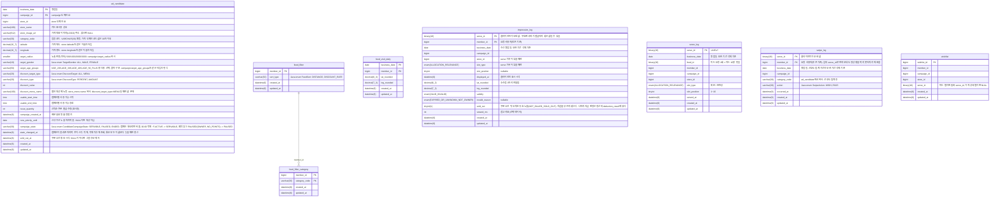

# adserving ERD

마이그레이션을 실제 MySQL 에 적용한 뒤 `information_schema` 에서 생성한 문서다.
**직접 고치지 않는다.** 스키마를 바꾼 뒤 `./gradlew generateErd` 로 다시 뽑는다.
`G-BUILD` 가 이 파일과 스키마가 어긋났는지 검사한다.

테이블 8개.

```mermaid
erDiagram
    ad_candidate {
        date business_date PK "영업일"
        bigint campaign_id PK "campaign 도메인 ID"
        bigint store_id "store 도메인 ID"
        varchar(100) store_name "카드 표시용 상호"
        varchar(512) store_image_url "가게 대표 이미지(LOGO) 주소. 없으면 NULL"
        varchar(30) category_code "업종 코드. VARCHAR(30) 확정, 가게 도메인 코드값은 30자 이내"
        decimal(10_7) latitude "가게 위도. store.latitude와 같은 이름과 타입"
        decimal(10_7) longitude "가게 경도. store.longitude와 같은 이름과 타입"
        smallint target_radius "노출 반경(미터) 500/1000/2000/3000. campaign.target_radius 복사"
        varchar(10) target_gender "Java enum TargetGender: ALL, MALE, FEMALE"
        varchar(50) target_age_groups "AGE_20S,AGE_30S,AGE_40S,AGE_50_PLUS 중 다중 선택, 콤마 구분. campaign.target_age_groups와 같은 타입과 형식"
        varchar(20) discount_target_type "Java enum DiscountTarget: ALL, MENU"
        varchar(20) discount_type "Java enum DiscountType: PERCENT, AMOUNT"
        int discount_value
        varchar(100) discount_menu_name "할인 대상 메뉴명. store_menu.name 복사. discount_target_type=MENU일 때만 값 존재"
        time usable_start_time "캠페인별 사용 가능 시작"
        time usable_end_time "캠페인별 사용 가능 종료"
        int issue_quantity "선착순 쿠폰 발급 수량(표시용)"
        datetime(6) campaign_created_at "배분 슬롯 동률 정렬 키"
        date new_priority_until "신규 우선 노출 마지막 날. NULL이면 대상 아님"
        varchar(30) campaign_state "Java enum CandidateCampaignState: SERVABLE, PAUSED, ENDED. 캠페인 통보로만 바뀜. 00:00 적재 시 ACTIVE -> SERVABLE, 예약 있는 PAUSED(OWNER, NO_POINTS) -> PAUSED"
        datetime(6) state_changed_at "캠페인이 알려준 마지막 전이 시각. 적재, 적재 직후 재조회, 통보 모두 이 값보다 늦을 때만 갱신"
        datetime(6) sold_out_at "쿠폰 소진 통보 시각. NULL이 아니면 그날 후보 제외"
        datetime(6) created_at
        datetime(6) updated_at
    }
    feed_filter {
        bigint member_id PK
        varchar(30) sort_type "Java enum FeedSort: DISTANCE, DISCOUNT_RATE"
        datetime(6) created_at
        datetime(6) updated_at
    }
    feed_filter_category {
        bigint member_id PK
        varchar(30) category_code PK
        datetime(6) created_at
        datetime(6) updated_at
    }
    feed_visit_daily {
        date business_date PK
        bigint member_id PK
        decimal(6_3) lat_rounded
        decimal(7_3) lng_rounded
        datetime(6) created_at
        datetime(6) updated_at
    }
    impression_log {
        binary(16) serve_id PK "클라이언트가 보낸 값. 무효면 서버가 발급하지 않은 값일 수 있음"
        bigint member_id PK "요청 사용자(토큰 기준)"
        date business_date "수신 영업일. 보관 기간 삭제 기준"
        bigint campaign_id
        bigint store_id "serve 기록이 있을 때만"
        enum(ALLOCATION_RELEVANCE) slot_type "serve 기록이 있을 때만"
        tinyint slot_position "nullable"
        datetime(6) displayed_at "클라이언트 표시 시각"
        decimal(6_3) lat_rounded "소수점 3자리 반올림"
        decimal(7_3) lng_rounded
        enum(VALID_INVALID) validity
        enum(EXPIRED_OR_UNKNOWN_NOT_OWNER) invalid_reason "nullable"
        tinyint(1) sold_out "쿠폰 소진 뒤 도착한 유효 노출(NOT_BILLED_SOLD_OUT). 차감을 부르지 않는다. 나머지 과금 판정은 정산의 deduction_result에 있다"
        int viewed_ms "참고 지표(선택 데이터)"
        datetime(6) created_at
        datetime(6) updated_at
    }
    serve_log {
        binary(16) serve_id PK "UUIDv7"
        date business_date "영업일. 보관 기간 삭제 기준"
        binary(16) feed_id "피드 요청 1회 = 카드 10장 묶음"
        bigint member_id
        bigint campaign_id
        bigint store_id
        enum(ALLOCATION_RELEVANCE) slot_type "배분 / 관련성"
        tinyint slot_position "1~10"
        datetime(6) served_at
        datetime(6) created_at
        datetime(6) updated_at
    }
    swipe_log {
        binary(16) serve_id PK "클라이언트가 보낸 값"
        bigint member_id PK "요청 사용자(토큰 기준). 남의 serve_id로 먼저 보내도 정상 행을 막지 못하게 키에 포함"
        date business_date "영업일. 선호도 집계 기간과 보관 기간 삭제 기준"
        bigint campaign_id
        varchar(30) category_code "ad_candidate에서 복사. 선호도 집계용"
        varchar(30) action "Java enum SwipeAction: WISH, PASS"
        datetime(6) occurred_at
        datetime(6) created_at
        datetime(6) updated_at
    }
    wishlist {
        bigint wishlist_id PK
        bigint member_id
        bigint campaign_id
        bigint store_id
        binary(16) serve_id "피드 찜이면 출처 serve_id, 가게 상세 찜이면 NULL"
        datetime(6) created_at
        datetime(6) updated_at
    }
    feed_filter ||--o{ feed_filter_category : "member_id"
```
